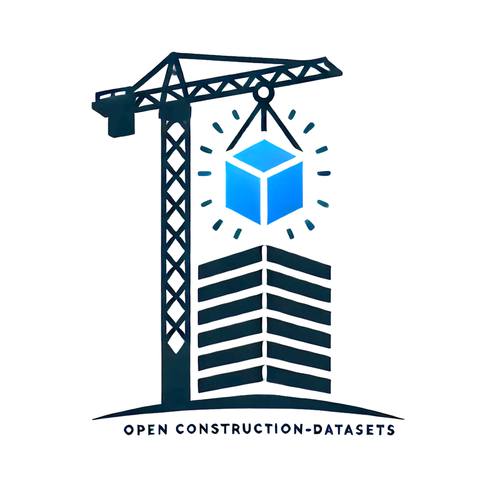

# 
&nbsp;OpenConstruction-Datasets

🏗️ OpenConstruction: A Systematic Survey and Analysis of Open-Access Visual Datasets for Data-Centric Artificial Intelligence in Construction Monitoring

## Overview 📋

OpenConstruction is a curated collection of publicly available datasets focused on construction monitoring and analysis. This repository serves as a central hub for researchers, practitioners, and developers working on AI applications in the construction industry.

## Motivation 🎯
The construction industry is rapidly adopting AI-driven computer vision solutions for monitoring, safety, and efficiency improvements. However, the development of effective AI models requires access to high-quality, diverse datasets. Our survey addresses this need by:

* Providing a comprehensive catalog of open-access construction-related datasets
* Standardizing dataset metadata for easy comparison and selection
* Facilitating the development and benchmarking of AI models
* Supporting reproducible research in construction AI

## Dataset Categories 📊

Our collection includes datasets for various construction-related tasks:

* Object Detection (PPE, equipment, materials)
* Semantic Segmentation
* Action Recognition
* Pose Estimation
* Image Captioning
* SLAM/Visual Localization

## Dataset Statistics 📈

* Total Datasets: 50+
* Time Span: 2015-2024
* Data Modalities: RGB, Thermal, Point Cloud, Synthetic
* Geographic Coverage: Multiple countries
* Various Annotation Types: Bounding boxes, segmentation masks, keypoints, captions

## Using the Repository 🔍

### Dataset Catalog
* Browse the complete dataset listing in `data/dataset_catalog.csv`
* Detailed metadata available in JSON format in `data/dataset_metadata/`
* Each dataset entry includes:
  * Basic information (name, year, size)
  * Data characteristics (modality, resolution, classes)
  * Task-specific annotations
  * Licensing information
  * Access links and citations

### Dataset Selection Guide
Consider the following when choosing datasets:
* Task requirements (detection, segmentation, etc.)
* Data modality needs
* Size and diversity requirements
* Licensing restrictions
* Geographical relevance

## Contributing to OpenConstruction 🤝

We welcome contributions from the community! Your support helps make this resource more valuable for everyone.

### How to Contribute

1. Fork the repository and create a branch for your contribution.
2. Make your changes and ensure any code tests pass.
3. Submit a pull request with a clear description of your updates.

### Types of Contributions

* **New Datasets**: Add entries for publicly available construction datasets
* **Metadata Enhancement**: Improve existing dataset descriptions
* **Documentation**: Enhance usage guides and examples
* **Bug Fixes**: Address issues in code or documentation
* **Feature Additions**: Add new tools or analysis capabilities

**Dataset Submissions:**
- Add a metadata file to `data/dataset_metadata/` following the structure of existing JSON files.
- Update `data/dataset_catalog.csv` with a new entry for your dataset.

## Contact 📧

For questions, suggestions, or collaboration opportunities:
* Open an issue in this repository
* Contact: rxiong3@kent.edu

## Acknowledgments 🙏

We thank all dataset creators and contributors who make their data publicly available for advancing construction AI research.

---

Made with ❤️ by the Construction AI Research Community. Thank you for making OpenConstruction better! 🙌
