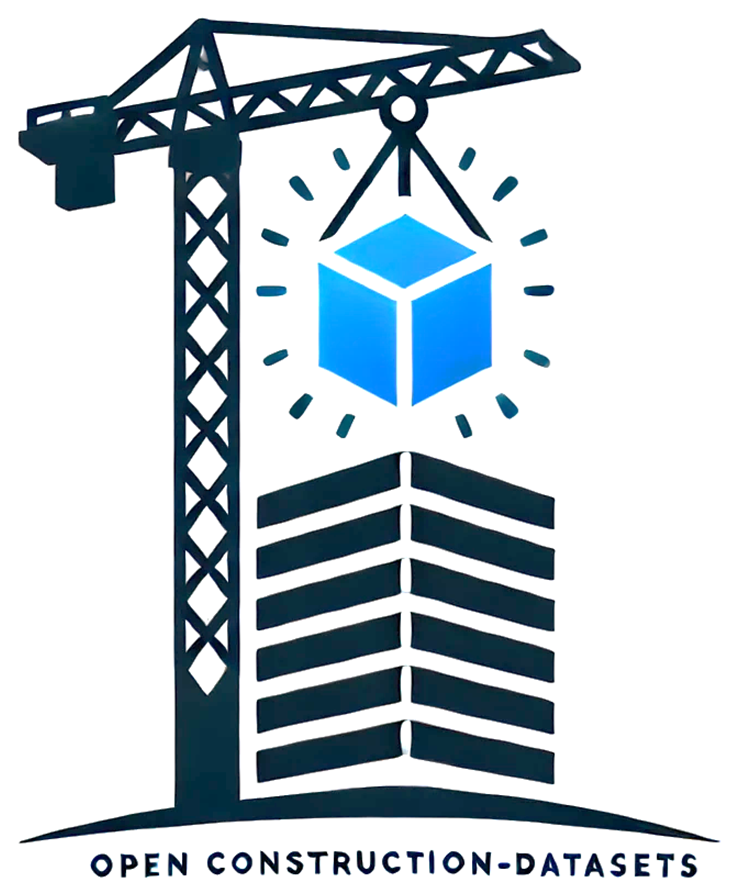

<table style="border: none; border-collapse: collapse; margin: 0 auto;">
  <tr style="border: none;">
    <td style="border: none; vertical-align: middle; width: 250px;">
      
    </td>
    <td style="border: none; vertical-align: middle; text-align: center;">
      <h1 style="margin-bottom: 0;">OpenConstruction Datasets</h1>
      <p style="margin-top: 0; font-size: 1.1em;">
        <em>
          A Systematic Synthesis of Open Visual Datasets for Data-Centric Artificial Intelligence in Construction Monitoring
		  
		  [](https://ruoxinx.github.io/open-construction) [](https://arxiv.org/abs/2508.11482) [](./LICENSE) [](https://github.com/ruoxinx/OpenConstruction-Datasets/issues)  
        </em>
      </p>
    </td>
  </tr>
</table>


## 🌐 Quick Links  

- **New Website (Explore Datasets):** [ruoxinx.github.io/open-construction](https://ruoxinx.github.io/open-construction)  
- **Suggest a New Dataset:** [Submit here](https://github.com/ruoxinx/OpenConstruction-Datasets/issues/new?template=new_dataset.yml)  
- **Share an Idea or Feedback:** [Open suggestion](https://github.com/ruoxinx/OpenConstruction-Datasets/issues/new?template=suggestion.yml)  
- **Request Dataset Removal:** Contact us at **[ruoxinx@outlook.com](mailto:ruoxinx@outlook.com)** from a verifiable email.  


## 📋 Overview  

**OpenConstruction** is a curated collection of open-access datasets for construction monitoring and analysis.  
It provides a centralized resource for researchers, practitioners, and developers working on AI applications in the construction industry.  


## 🎯 Motivation  

AI-driven computer vision is transforming construction monitoring, safety management, and productivity. Yet, robust AI development requires access to diverse and well-documented datasets.  

This project addresses that need by:  
- Compiling a **comprehensive catalog** of construction datasets  
- Standardizing metadata for easier comparison and selection  
- Supporting **benchmarking and reproducible research**  
- Facilitating AI model development across tasks and modalities  


## 📊 Dataset Categories  

Our catalog spans a variety of construction-relevant tasks:  

- **Object Detection** 
- **Semantic Segmentation**  
- **Action Recognition**  
- **Pose Estimation**  
- **Image Captioning**  
- **SLAM / Visual Localization**  


## 📈 Dataset Statistics  

- **Total Datasets:** 50+   
- **Modalities:** RGB, Thermal, Depth, LiDAR/Point Cloud, Synthetic  
- **Annotations:** Bounding boxes, segmentation masks, keypoints, captions  
- **Geographic Coverage:** Multi-country, diverse contexts  


## 🤝 Contributing  

We welcome community contributions to grow and improve this catalog.  

Use the quick templates:  
- [Suggest a New Dataset](https://github.com/ruoxinx/OpenConstruction-Datasets/issues/new?template=new_dataset.yml)  
- [Share Feedback](https://github.com/ruoxinx/OpenConstruction-Datasets/issues/new?template=suggestion.yml)  


## 📧 Contact  

For questions, suggestions, or collaboration:  
- Open an [issue](https://github.com/ruoxinx/OpenConstruction-Datasets/issues)  
- Email: **rxiong3@kent.edu**  

---

## 🙏 Acknowledgments  

We thank all dataset creators and contributors for making their resources publicly available to advance AI in construction.  

### Reference  

```bibtex
@misc{xiong2025openconstructionsystematicsynthesisopen,
      title={OpenConstruction: A Systematic Synthesis of Open Visual Datasets for Data-Centric Artificial Intelligence in Construction Monitoring}, 
      author={Ruoxin Xiong and Yanyu Wang and Jiannan Cai and Kaijian Liu and Yuansheng Zhu and Pingbo Tang and Nora El-Gohary},
      year={2025},
      eprint={2508.11482},
      archivePrefix={arXiv},
      primaryClass={cs.CV},
      url={https://arxiv.org/abs/2508.11482}, 
}
